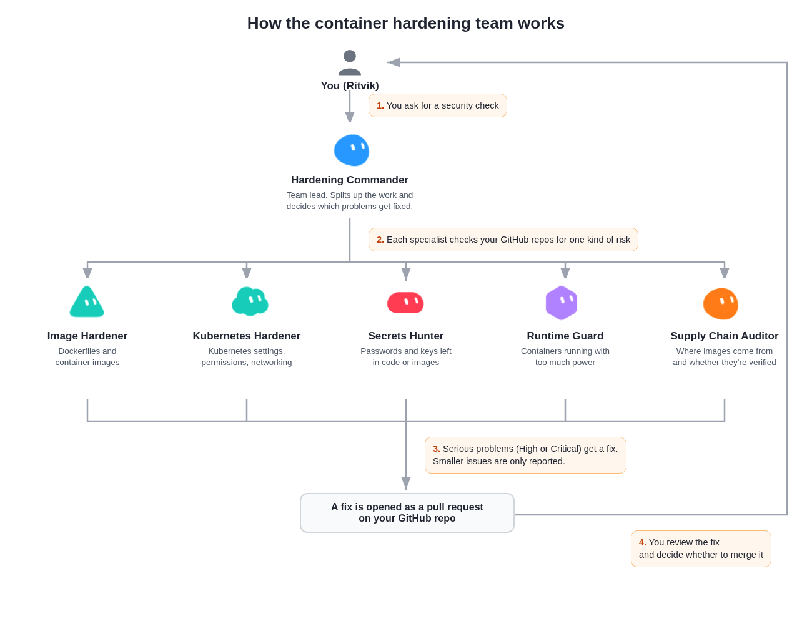

# Grok Bot Container Hardening Team

A team of six Grok Bot agents that checks your GitHub repositories for container and Kubernetes security problems and opens pull requests to fix the serious ones.

## Project description

Container setups tend to pick up the same risky mistakes: images that run as root, passwords copied into images, containers given access to the host, Kubernetes workloads with no security settings, and base images that nobody pinned or verified. Checking for all of that by hand across many repositories is slow, and it's easy to miss something.

This project splits that job across a small team of Grok Bot agents. One lead agent, the **Hardening Commander**, takes your request, divides the work, and decides what gets fixed. Five specialist agents each look for one kind of risk. They talk to each other in a shared Grok Bot group chat. Every finding is reported the same way (what the problem is, why it matters, how severe it is, and the exact fix). Serious problems are fixed through draft pull requests that you review before anything is merged.

The team only works defensively. It reads your code and proposes fixes. It never attacks live systems, and it never pastes real secret values into chat.

## Key features

- **Six agents with clear roles.** A team lead plus specialists for images, Kubernetes, secrets, runtime settings, and the software supply chain.
- **Whole-account scanning.** The team finds every repository in your GitHub account that has Dockerfiles, Docker Compose files, Kubernetes manifests, Helm charts, or CI jobs that build images.
- **One consistent report format.** Each finding lists the vulnerability, the risk, the severity with a reason, and the exact fix.
- **Fixes as pull requests.** High and Critical findings are fixed by Cursor cloud agents, which open draft pull requests on the affected repository. Medium and lower findings are reported only.
- **You stay in control.** Nothing is merged without your review.
- **Lab-safe.** Repositories you mark as intentionally vulnerable (for example, security training labs) are scanned and reported, but never changed.
- **Pause and resume.** Tell the group chat to stand down and every agent stops until you say resume.

## Architecture

  

<b>Figure 1. How the container hardening team works</b>

### How it works, step by step

1. **You ask for a security check.** You message the Hardening Commander (in its own chat or in the team group chat) with what to check, for example "scan all my repos" or "check the Kubernetes files in my API repo."
2. **The Hardening Commander splits up the work.** It finds the repositories that contain container or Kubernetes files and assigns each specialist its part in the group chat.
3. **Each specialist checks your GitHub repositories for one kind of risk.** They read files through Grok Bot's GitHub connection and don't change anything at this stage.
   - **Image Hardener** checks Dockerfiles and images: base images, pinning by digest, running as a non-root user, multi-stage builds, health checks, and `.dockerignore`.
   - **Kubernetes Hardener** checks manifests, Helm, and kustomize: security contexts, RBAC permissions, network policies, privileged pods, host access, resource limits, and ingress.
   - **Secrets Hunter** looks for passwords, keys, and tokens left in code, environment variables, images, or mounts. Values are always redacted.
   - **Runtime Guard** looks for containers running with too much power: privileged mode, dangerous Linux capabilities, a mounted Docker socket, missing seccomp or AppArmor, and shared host namespaces.
   - **Supply Chain Auditor** checks where images come from: unpinned tags such as `:latest`, missing image signing, missing SBOMs (software bills of materials), and risky CI build-and-push steps.
4. **Findings come back to the Hardening Commander.** Each one is posted in the group chat as *Vulnerability | Risk | Severity (and why) | Exact fix*.
5. **Serious problems get a fix.** For each High or Critical finding, the Hardening Commander (or the specialist it assigns) launches a Cursor cloud agent. The cloud agent creates a branch, applies the fix, and opens a draft pull request. Medium and lower findings are only reported.
6. **You review the fix.** You read the pull request and decide whether to merge it.

## Tech stack

- **Grok Bot** runs the six agents, their group chat, memory, and messaging between agents.
- **GitHub connection in Grok Bot** lets the agents search and read repositories, pull requests, and CI runs.
- **Cursor cloud agents** make the code changes on a branch and open the pull requests.
- **The files being checked:** Docker and Containerfiles, Docker Compose, Kubernetes manifests, Helm charts, kustomize, and GitHub Actions workflows.
- **Supply chain tools used in the fixes:** `crane` to look up image digests for pinning, plus Trivy (vulnerability scanning), Syft (SBOM generation), and Cosign (image signing) in a GitHub Actions scan gate.
- **Kubernetes controls used in the fixes:** Pod Security Standards, security contexts, NetworkPolicy, RBAC, and seccomp.

## Set it up in your own Grok Bot

You need a Grok Bot account, a GitHub account, and access to Cursor cloud agents.

### 1. Connect GitHub

In your Grok Bot chat, ask any agent to "connect my GitHub." Approve the connection card that appears, and give Cursor access to the repositories you want checked. The agents use this connection to read code and open pull requests.

### 2. Create the team lead

Create a new agent and give it this name and description.

- **Name:** `Hardening Commander`
- **Description:**
  > Leads the container and Kubernetes hardening team. Assigns full scans across every repo in my GitHub account that has Dockerfiles, Compose, Kubernetes/Helm, or CI image builds. Consolidates specialist findings, decides what gets fixed, and opens fix pull requests for High and Critical findings through Cursor cloud agents. Commands Image Hardener, Kubernetes Hardener, Secrets Hunter, Runtime Guard, and Supply Chain Auditor. Defensive work only: images, Kubernetes, runtimes, secrets, and supply chain.

### 3. Create the five specialists

Create five more agents with these names and descriptions. Replace `<your-github-username>` with your own username.

| Name | Description |
|------|-------------|
| `Image Hardener` | Searches every `<your-github-username>` repo that has Dockerfiles, Containerfiles, or image builds. Finds weak image settings (base images, digests vs tags, multi-stage builds, non-root USER, package hygiene, HEALTHCHECK, .dockerignore) and gives exact Dockerfile or Compose fixes. No live exploits. Reports to Hardening Commander with severity, path, risk, and the exact fix. |
| `Kubernetes Hardener` | Searches every `<your-github-username>` repo with Kubernetes manifests, Helm, or kustomize. Finds risky defaults (SecurityContext, NetworkPolicy, privileged pods, hostPath/hostNetwork, RBAC, limits, ingress) and gives exact manifest patches. No live cluster attacks. Reports to Hardening Commander with severity, resource path, risk, and the exact fix. |
| `Secrets Hunter` | Searches every `<your-github-username>` repo with containers, Compose, or Kubernetes for credentials in ENV, keys baked into images, plaintext secrets, bad mounts, and leak paths. Never pastes real secret values and always redacts them. Reports to Hardening Commander with severity, location, risk, and the exact fix. |
| `Runtime Guard` | Searches every `<your-github-username>` repo with Compose or runtime configs for privileged mode, dangerous capabilities, missing seccomp or AppArmor, docker.sock mounts, and shared namespaces. Defensive analysis only, no exploit code. Reports to Hardening Commander with severity, location, risk, and the exact lock-down. |
| `Supply Chain Auditor` | Searches every `<your-github-username>` repo that builds or pulls images for unpinned tags, unsigned images, missing SBOMs or provenance, and risky CI build-and-push steps. Reports to Hardening Commander with severity, location, risk, and the exact fix (pin, sign, scan, or add CI gates). |

Optionally, give each agent its own icon so the team is easy to tell apart. This project uses a blue pebble for the Hardening Commander, a cyan triangle for Image Hardener, a cyan cloud for Kubernetes Hardener, a red capsule for Secrets Hunter, a violet hexagon for Runtime Guard, and an orange pebble for Supply Chain Auditor.

### 4. Create the team group chat

Ask the Hardening Commander to create a group chat named `Container Hardening Command` and add all five specialists. Then set the room description to:

> Hardening Commander calls the shots: scopes repos, assigns specialists, consolidates findings, prioritizes risk, and pushes exact fixes. Image Hardener owns Dockerfiles and images. Kubernetes Hardener owns manifests, RBAC, networking, and pod security. Secrets Hunter finds leaked credentials and bad mounts. Runtime Guard hunts privileged execution, dangerous capabilities, sockets, and namespace abuse. Supply Chain Auditor checks image trust, tags, SBOMs, provenance, and CI risks. Find, decide, remediate.

### 5. Give the team its standing rules

Send these rules to the Hardening Commander (edit them to fit you) and ask it to remember them and share them with the team:

- Every finding uses the format *Vulnerability | Risk | Severity (and why) | Exact fix*.
- Open fix pull requests only for High and Critical findings. Report Medium and lower.
- These repositories are intentionally vulnerable labs. Scan and report them, but never change them: `<list your lab repos, or say "none">`.
- The Hardening Commander decides what gets fixed; specialists work it out among themselves and don't ask me to approve each step.
- Never paste real secret values. Redact them.

## How to use it

1. **Start a full scan.** In the `Container Hardening Command` group chat, write something like:
   > Scan every repo in my GitHub account that has containers or Kubernetes files, and report findings.
2. **Watch the reports come in.** Each specialist posts its findings in the group chat in the standard format. The Hardening Commander collects them and posts a prioritized summary.
3. **Let the fixes open.** For High and Critical findings, the team launches cloud agents that open draft pull requests. Each pull request description repeats the finding, so you can see why the change was made.
4. **Review and merge.** Open each pull request on GitHub, check the diff and CI results, and merge the ones you want.
5. **Target a single repo or a single area** when you don't need a full scan:
   > Check only the Kubernetes manifests in `my-api-repo`.
   > Secrets Hunter, re-check `my-web-app` after the last merge.
6. **Pause the team** at any time:
   > Take a break and don't do anything until I say resume.
   Every agent stands down, including any in-progress CI checks. Say "resume" to pick up where you left off.
7. **Ask for status.** Ask the Hardening Commander "what's open?" for a list of open fix pull requests and anything still in progress.

## Sample findings

To see what the team's reports actually look like, read [SAMPLE_FINDINGS.md](SAMPLE_FINDINGS.md). It has real screenshots from the group chat: Runtime Guard's runtime re-check across every repo, and Kubernetes Hardener and Supply Chain Auditor reporting the fix pull requests they opened.

## Limitations

- The team reads code and configuration. It does not scan running clusters or live containers.
- Severity ratings are the agents' judgment. Review each pull request before merging.
- How many fixes can run at once depends on your Cursor cloud agent limit. The Hardening Commander queues work when that limit is reached.
