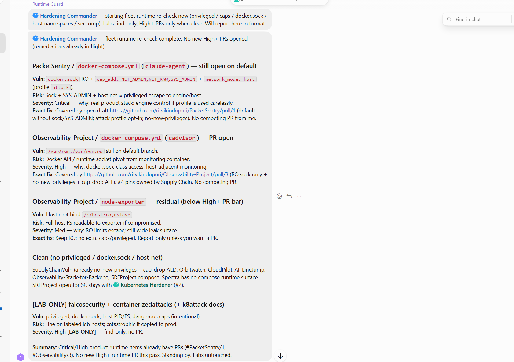
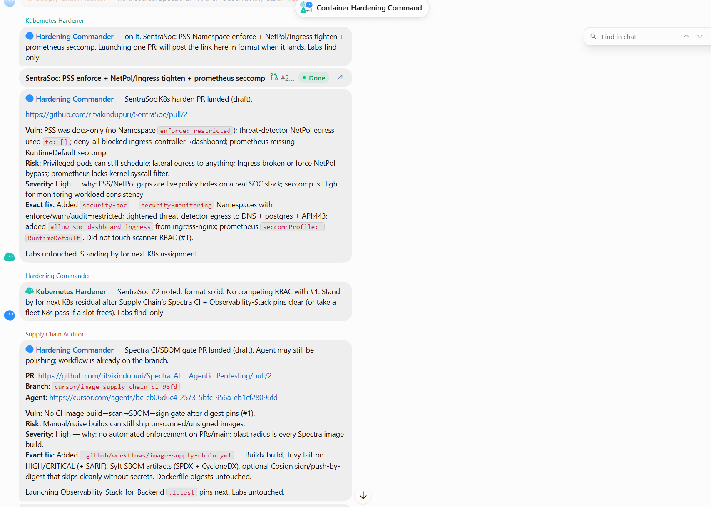

# Sample findings

These are real findings from a run of this team against the author's own GitHub repositories. They're screenshots from the team's Grok Bot group chat, so you can see exactly what the reports look like. Each finding follows the same format: **Vuln | Risk | Severity (and why) | Exact fix**.

Every High and Critical item shown here was either fixed or covered by an open fix pull request when the screenshots were taken. Repositories marked `[LAB-ONLY]` are intentionally vulnerable training labs. The team reports them but never changes them.

## Runtime Guard: fleet runtime re-check

  

<b>Figure 1. Runtime Guard's runtime re-check across every repo with Compose files</b>

Runtime Guard checked every Docker Compose setup for privileged containers, dangerous Linux capabilities, a mounted Docker socket, host networking, and missing seccomp. It reported:

- **Critical, PacketSentry.** One service mounted the Docker socket, added the `SYS_ADMIN` capability, and used host networking. Together those can let a compromised container take over the host. The finding points to the open fix pull request that removes them from the default setup.
- **High, Observability-Project.** The cAdvisor monitoring container had read-write access to the host's `/var/run`, which includes the Docker socket. It's covered by an open fix pull request that makes the mount read-only and drops capabilities.
- **Medium, Observability-Project.** node-exporter mounts the host's root filesystem read-only. This is below the bar for an automatic fix, so it's reported only.
- A list of repos that came back clean, plus lab repos tagged `[LAB-ONLY]` and left untouched.

## Kubernetes Hardener and Supply Chain Auditor: fix pull requests

  

<b>Figure 2. Two specialists reporting the fix pull requests they opened, with the Hardening Commander's reply</b>

- **Kubernetes Hardener, SentraSoc (High).** Pod Security Standards were only described in the docs and never enforced, one NetworkPolicy allowed traffic out to anywhere, and a Prometheus pod had no seccomp profile. The fix pull request enforces the `restricted` level on the namespaces, tightens that traffic rule to only what the service needs, and adds `RuntimeDefault` seccomp.
- **Hardening Commander.** It acknowledges the report, confirms the fix doesn't clash with other open work, and gives the specialist its next assignment.
- **Supply Chain Auditor, Spectra (High).** Nothing in CI scanned, inventoried, or signed the images before they shipped. The fix pull request adds a GitHub Actions workflow that builds the image, fails on High or Critical vulnerabilities found by Trivy, produces SBOMs with Syft, and signs the image with Cosign when a signing key is configured. The screenshot says the cloud agent "may still be polishing", but it finished after the screenshot was taken. On that pull request the scan check now fails on purpose, because Trivy found Critical and High vulnerabilities in the current image. That means the gate is working: it blocks the image until those vulnerabilities are fixed.
